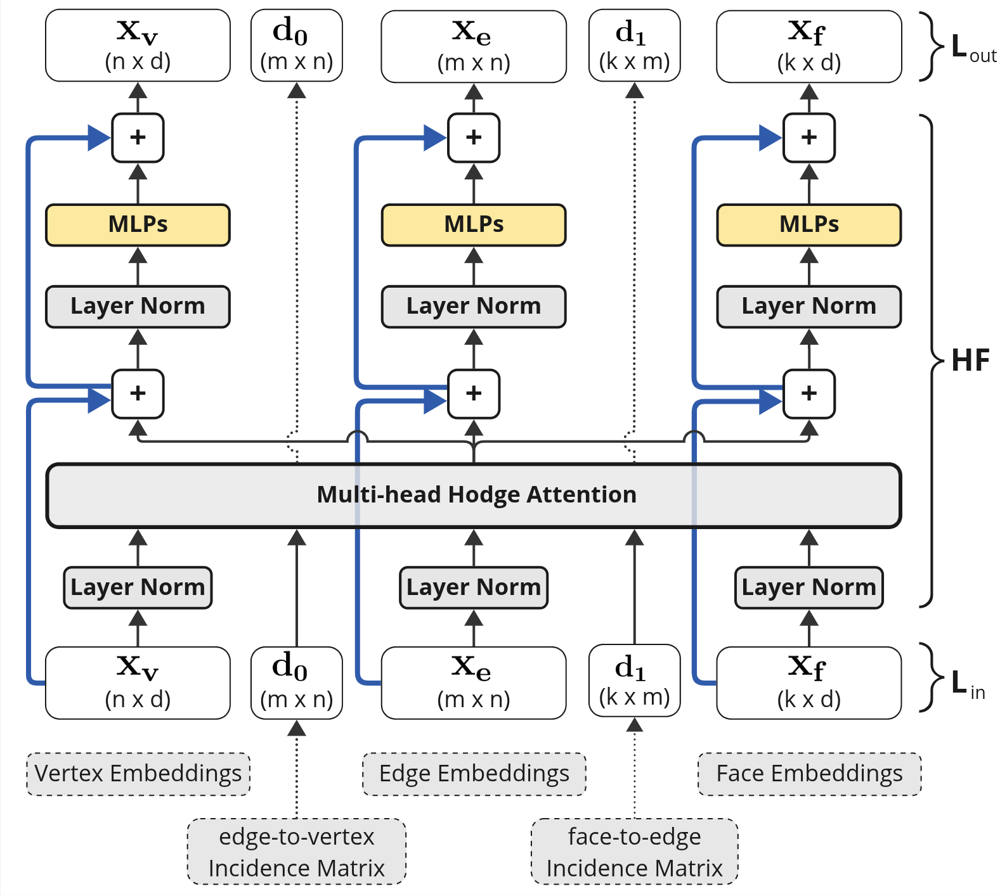
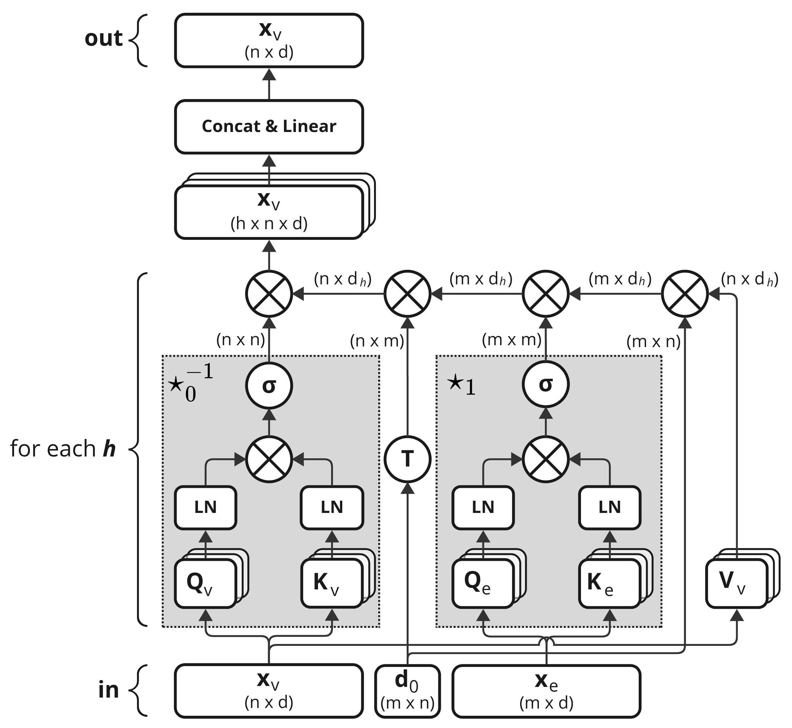

# HodgeFormer: Transformers for Learnable Operators on Triangular Meshes through Data-Driven Hodge Matrices

<div align="center">

[](https://arxiv.org/abs/2509.01839)
[](https://hodgeformer.github.io/)

**🔥 *Accepted in WACV, 2026***

</div>

<p align="middle">
  
  
</p>

This repository holds code for the HodgeFormer deep learning architecture operating on mesh data. Links:

- *Project page*: https://hodgeformer.github.io/
- *Paper*: https://arxiv.org/abs/2509.01839

**Prolem statement**: Currently, prominent Transformer architectures applied on graphs and meshes for shape analysis tasks 
employ traditional attention layers that heavily utilize spectral features requiring costly eigenvalue 
decomposition-based methods. To encode the mesh structure, these methods derive positional embeddings 
that heavily rely on eigenvalue decomposition based operations, e.g. on the Laplacian matrix, or on 
heat-kernel signatures, which are then concatenated to the input features.
<!-- 
**Problem statement**: Existing methods for 3D mesh analysis using spectral features rely on costly eigendecomposition of 
Laplacian matrices, creating a computational bottleneck and exhibiting high complexity. Alternative
convolutional-based methods are often constrained by architectural limitations: some require specific 
mesh connectivity to construct their operators or use fixed operators that may not adapt to the underlying
data.

Modern Transformer-based still depend on pre-computed spectral features for positional encoding. This 
reliance on expensive, rigid, and often complex preprocessing steps limits the efficiency, scalability, 
and flexibility of deep learning on meshes. -->

> [!IMPORTANT]
> **Core contribution**: This paper proposes a novel approach inspired by the explicit construction of 
the Hodge Laplacian operator in Discrete Exterior Calculus as a product of discrete Hodge operators 
and exterior derivatives, i.e. $L := \star_0^{-1} d_0^T \star_1 d_0$. 
> 
> We adjust the Transformer architecture in a novel deep learning layer that utilizes the multi-head 
attention mechanism to approximate Hodge matrices $\star_0, \star_1$ and $\star_2$ and learn families
of discrete operators $L$ that act on mesh vertices, edges and faces.
>
> Our approach results in a computationally-efficient architecture that achieves comparable performance 
in mesh segmentation and classification tasks, through a direct learning framework, while eliminating 
the need for costly eigenvalue decomposition operations or complex preprocessing operations.


## Modules

The code in this repository consists of two python packages, `mesh_sim` and `mesh_opformer`:

- The `mesh_sim` package for reading meshes along with functionalities for extracting useful geometric features. 
  For the experiments `mesh_o3d` is used instead of `mesh_sim` in several places.

- The `mesh_opformer` package for the layer definitions of the HodgeFormer architecture along with dataset 
  definitions and utility modules for training and evaluation.

The packages follow the `src` structure format and need to be installed as python packages in a python environment.
Preferably, create a new python environment to hold the package installations using `venv` or `conda`. Then either
install the packages in *development mode* or as *wheel files*.

For each experiment, training and evaluation scripts are provided in dedicated folders in the [experiments](./experiments/) 
folder along with configuration files and documentation.

**Note:** All experiments were conducted with **Python 3.10**.


### Installation in development mode

For each package, navigate to the package top-level directories, where `setup.py` file is located, and install the
package in development mode:
```bash
cd ./packages/mesh_sim
pip install -e .
```

```bash
cd ./packages/mesh_opformer
pip install -e .
```


### Installation as wheel packages

Alternatively, for each package build the corresponding `.whl` file:

```bash
python setup.py bdist_wheel 
```

Install the packages via their `.whl` files using `pip`:
```bash
pip install <package>.whl
```


## Experiments

The paper experiments are organized in a dedicated [experiments folder](./experiments/). Each dataset used in the paper
has its own subfolder with code and an accompanying configuration file for training and evaluating HodgeFormer models. 
In total, there are experiments for four different datasets on the tasks of *mesh classification* and *mesh segmentation*:
- SHREC-11 - *mesh classification*: [link](./experiments/classification_shrec/)
- Cube Engraving - *mesh classification*: [link](./experiments/classification_cube_engraving/)
- COSEG Chairs, Aliens, Vases - *mesh segmentation*: [link](./experiments/segmentation_coseg/)
- Human - *mesh segmentation*: [link](./experiments/segmentation_human/)


### Configuration

The configuration files are written in `toml` format and are used to control dataset paths, data preprocessing, model 
architecture, training, and evaluation parameters. Documentation about the configuration sections can be found in the
[readme file](./experiments/README.md) at the experiments folder. Results are stored and visualized using the `wandb` 
library. If you have a `wandb` account, you can enable it by configuring the following sections in your config file:

```toml
[wandb]
WANDB_MODE = "online"     # Options: 'online', 'offline', 'disabled'
name = "hodgeformer-shrec11"

[wandb.init]
project = "project-name"
entity = "user-wandb-account"
```


### Execution Examples

Extensive execution examples are available in the accompanying documentation files of each dataset in the [experiments](./experiments/) 
folder. 

Below is an example for training and performing inference with a classification model on the SHREC11 dataset. For inference, one can use
the provided entry point `infer-hodgeformer` which is installed along the installation of the `mesh_opformer` package. Alternatively, one
can use the script provided [here](./experiments/inference/infer_hodgeformer.py) with the same inputs.

Executed from the `/experiments/classification_shrec` folder.

- Training:
```bash
python classification_shrec.py --cfg_path ./classification_shrec11_cfg.toml --out ./runs
```

- Inference:
```bash
infer-hodgeformer \
  --model ./path/to/model.pth \
  --cfg_path ./classification_shrec11_cfg.toml \
  --dataset_path ./data/shrec16/dinosaur/test \
  --out ./out.json 
```


### Citation 

If you find this work useful for your research, please cite:
- A. Nousias and S. Nousias, “HodgeFormer: Transformers for Learnable Operators on Triangular Meshes through Data-Driven Hodge Matrices,” 
  2025, arXiv. doi: 10.48550/ARXIV.2509.01839.

With the following bibtex entry:

```bibtex
@article{nousias2025hodgeformer,
      title={HodgeFormer: Transformers for Learnable Operators on Triangular Meshes through Data-Driven Hodge Matrices}, 
      author={Akis Nousias and Stavros Nousias},
      year={2025},
      eprint={2509.01839},
      archivePrefix={arXiv},
      primaryClass={cs.GR},
      url={https://arxiv.org/abs/2509.01839}, 
}
```
